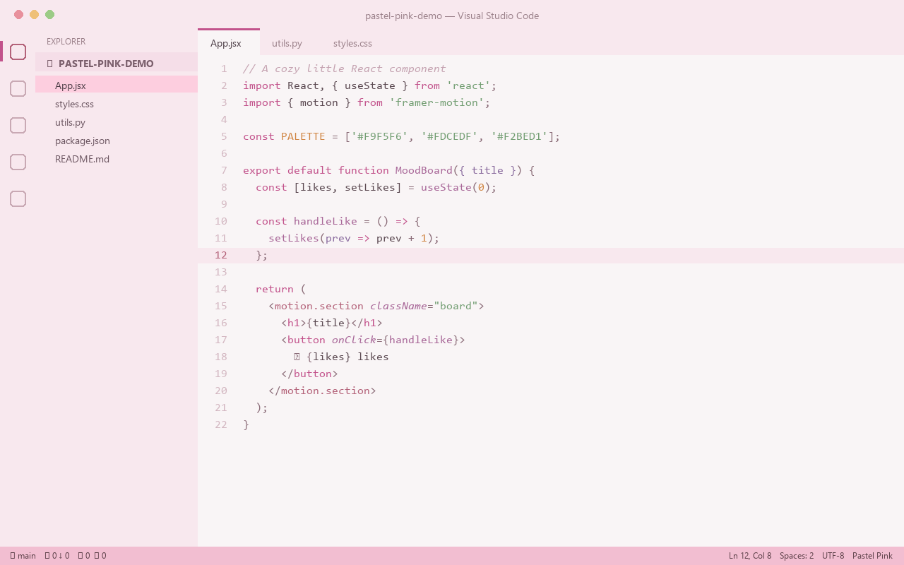
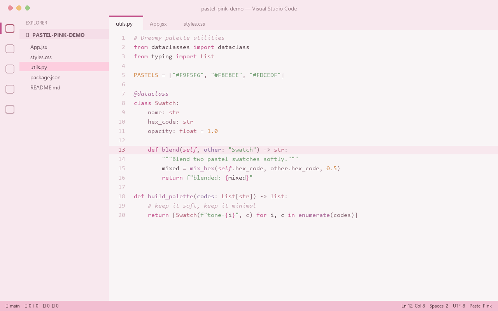
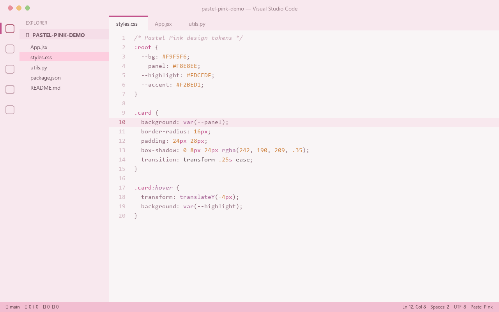
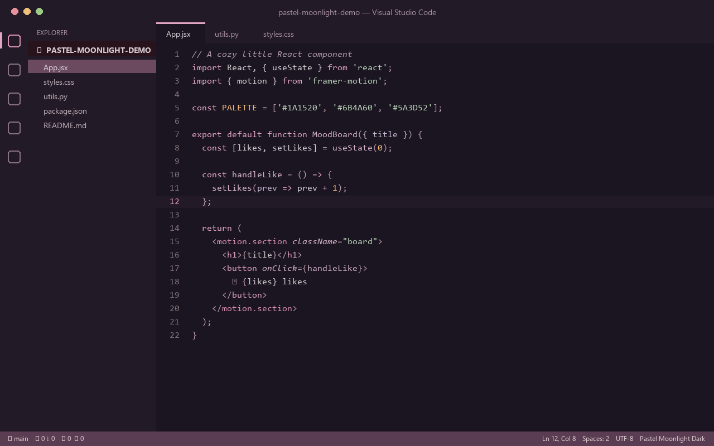

# Pastel Moonlight Theme 🌙

[](https://marketplace.visualstudio.com/items?itemName=lilinhuang.pastel-moonlight-theme) [](https://marketplace.visualstudio.com/items?itemName=lilinhuang.pastel-moonlight-theme)

> A soft, modern pastel pink theme for creative developers. Already available on the [VS Code Marketplace](https://marketplace.visualstudio.com/items?itemName=lilinhuang.pastel-moonlight-theme).

**Pastel Moonlight** is not a "cute pink" theme — it's a **refined pastel aesthetic** inspired by Pinterest moodboards, Notion pastel style, and cozy creative workspaces under a soft moonlit sky. Designed for frontend developers, designers, AI builders, and anyone who wants their editor to feel like a calm, beautiful place to create.

---

## ✨ Features

- **Soft pastel palette** — light pink-white editor background (`#F9F5F6`) that stays gentle during long coding sessions
- **Unified pastel UI** — Sidebar, Activity Bar, Panel, and Status Bar share one cohesive pastel pink family
- **Soft selection & highlights** — selection uses a dreamy `#FDCEDF`, never harsh or saturated
- **Carefully tuned syntax colors**:
  - Keywords → deep rose pink for clear recognition
  - Functions → soft purple-pink
  - Strings → low-saturation green
  - Numbers → warm orange
  - Comments → muted gray-pink, low visual noise
- **Semantic highlighting** support for accurate token coloring
- **Dark variant included** — switch to **Pastel Moonlight Dark** (deep warm purple-black base, same pastel syntax palette) for low-light sessions
- **Optimized for**: JavaScript, TypeScript, React (JSX/TSX), HTML, CSS, JSON, Python, Markdown

## 🎨 Color Palette

| Role       | Color     |
| ---------- | --------- |
| Background | `#F9F5F6` |
| Panel      | `#F8E8EE` |
| Highlight  | `#FDCEDF` |
| Accent     | `#F2BED1` |
| Keyword    | `#C2528B` |
| Function   | `#A86798` |
| String     | `#739E73` |
| Number     | `#D08543` |
| Comment    | `#C5A3B1` |

## 📦 Installation

### From Marketplace

👉 [Open in VS Code Marketplace](https://marketplace.visualstudio.com/items?itemName=lilinhuang.pastel-moonlight-theme)

1. Open **Extensions** in VS Code (`Ctrl+Shift+X` / `Cmd+Shift+X`)
2. Search for **"Pastel Moonlight Theme"**
3. Click **Install**
4. Open Command Palette (`Ctrl+K Ctrl+T` / `Cmd+K Cmd+T`) → select **Pastel Moonlight**

### From VSIX

```bash
code --install-extension pastel-moonlight-theme-1.0.4.vsix
```

### Build from source

```bash
npm install -g @vscode/vsce
vsce package
```

## 📷 Screenshots

### JavaScript / React



### Python



### CSS



### Dark Variant (Pastel Moonlight Dark)



## 💡 Recommended Settings

For the full cozy experience:

```json
{
  "editor.fontFamily": "'JetBrains Mono', 'Fira Code', monospace",
  "editor.fontLigatures": true,
  "editor.cursorBlinking": "smooth",
  "editor.smoothScrolling": true,
  "workbench.iconTheme": "material-icon-theme"
}
```

## 🤝 Feedback

Found a color that doesn't feel right? Open an issue — feedback on contrast and readability is always welcome.

## 📄 License

Non-Commercial License. See [LICENSE](LICENSE) for details.

---

